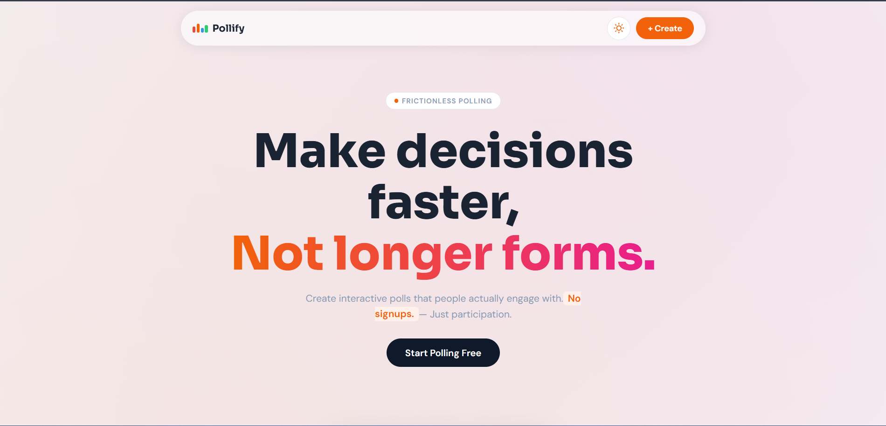
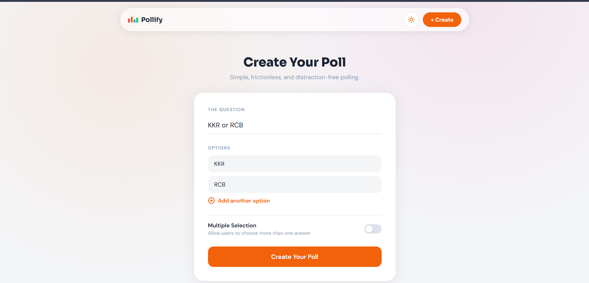
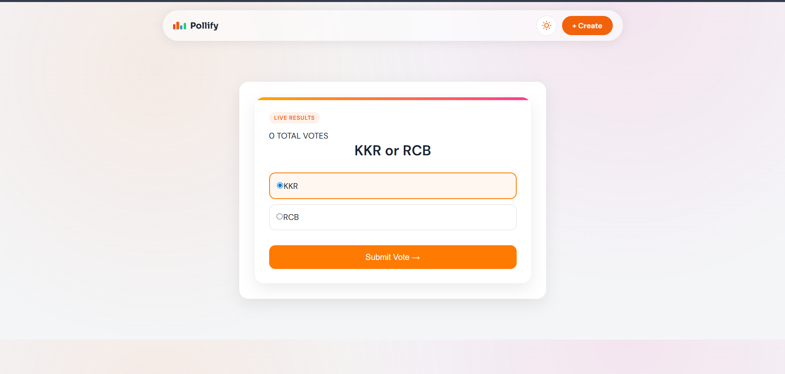
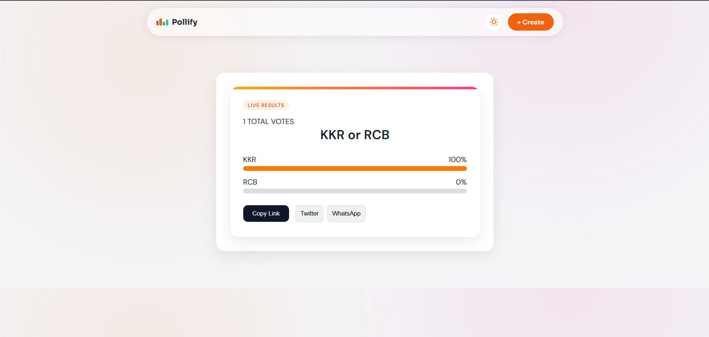

<div align="center">

# 🚀 Pollify

### Real-time Polling Web App


<br>

🌐 **Live Demo**  
https://pollify-e197f.web.app

</div>

---

## ✨ Features

- ✅ Create polls instantly
- ✅ Share poll link
- ✅ Live voting results
- ✅ Real-time Firestore updates
- ✅ No login required
- ✅ Responsive UI
- ✅ Firebase hosting
- ✅ Modern design

---

## 🛠 Tech Stack

| Tech | Use |
|------|------|
| React | UI |
| Vite | Build |
| Firebase | Backend |
| Firestore | Database |
| React Router | Routing |
| CSS | Styling |

---

## 📸 Screenshots

### Home



### Create Poll



### Vote Page



### Result



---

## 🚀 Run Locally

```bash
git clone https://github.com/Vishal795-knightrider/Pollify.git
cd Pollify
npm install
npm run dev
